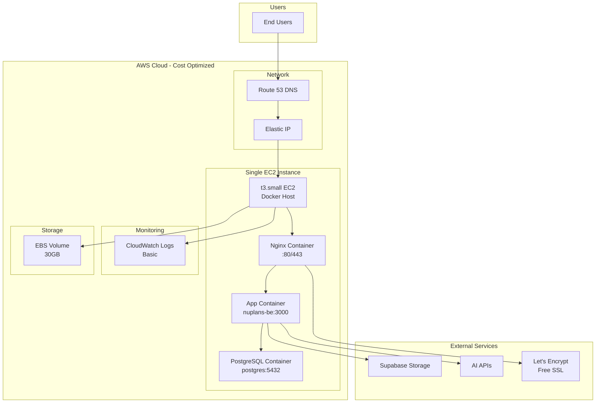

# AWS Deployment - Demo/Cost-Optimized Version

> [!NOTE]
> Phương án này phù hợp cho **demo, development, staging** hoặc **low-traffic production**. Chi phí giảm từ ~$212/tháng xuống còn **~$25-35/tháng** (giảm 85%).

## 🎯 Kiến trúc tối ưu chi phí



## 💰 So sánh chi phí

| Component | Production | Demo/Optimized | Tiết kiệm |
|-----------|-----------|----------------|-----------|
| **Compute** | ECS Fargate: $30-60 | EC2 t3.small: $15 | **$15-45** |
| **Database** | RDS Multi-AZ: $120 | PostgreSQL on EC2: $0 | **$120** |
| **Load Balancer** | ALB: $25 | Nginx on EC2: $0 | **$25** |
| **ECR** | $1 | Docker Hub: $0 | **$1** |
| **S3** | $5 | Minimal: $1 | **$4** |
| **CloudWatch** | $10 | Basic: $2 | **$8** |
| **Secrets Manager** | $2 | .env file: $0 | **$2** |
| **WAF** | $10 | Basic firewall: $0 | **$10** |
| **SSL** | ACM: $0 | Let's Encrypt: $0 | $0 |
| **Route 53** | $0.50 | $0.50 | $0 |
| **Data Transfer** | $9 | $3 | **$6** |
| **Elastic IP** | - | $0 (attached) | - |
| **EBS Storage** | - | 30GB: $3 | - |
| **TOTAL** | **$212-242** | **$24.50** | **~$190** |

> [!IMPORTANT]
> Tiết kiệm **~85% chi phí** so với production setup!

---

## 🚀 Setup chi tiết

### 1. Launch EC2 Instance

#### Cấu hình EC2

```yaml
Instance Type: t3.small
  - vCPU: 2
  - RAM: 2 GB
  - Network: Up to 5 Gbps
  - Cost: ~$15/month (Reserved) hoặc ~$0.0208/hour (On-Demand)

AMI: Ubuntu 22.04 LTS (free tier eligible)

Storage: 
  - Root: 30 GB gp3 (~$3/month)
  - IOPS: 3000 (default)

Network:
  - VPC: Default VPC
  - Subnet: Public subnet
  - Auto-assign Public IP: Yes
  - Elastic IP: Yes (để IP không đổi khi restart)

Security Group:
  - SSH (22): Your IP only
  - HTTP (80): 0.0.0.0/0
  - HTTPS (443): 0.0.0.0/0
  - Custom (3000): 0.0.0.0/0 (optional, for testing)
```

#### Launch Command (AWS CLI)

```bash
# Create security group
aws ec2 create-security-group \
  --group-name nuplans-demo-sg \
  --description "Security group for Nuplans demo server"

# Add rules
aws ec2 authorize-security-group-ingress \
  --group-name nuplans-demo-sg \
  --protocol tcp --port 22 --cidr YOUR_IP/32

aws ec2 authorize-security-group-ingress \
  --group-name nuplans-demo-sg \
  --protocol tcp --port 80 --cidr 0.0.0.0/0

aws ec2 authorize-security-group-ingress \
  --group-name nuplans-demo-sg \
  --protocol tcp --port 443 --cidr 0.0.0.0/0

# Launch instance
aws ec2 run-instances \
  --image-id ami-0c55b159cbfafe1f0 \
  --instance-type t3.small \
  --key-name your-key-pair \
  --security-groups nuplans-demo-sg \
  --block-device-mappings '[{"DeviceName":"/dev/sda1","Ebs":{"VolumeSize":30,"VolumeType":"gp3"}}]' \
  --tag-specifications 'ResourceType=instance,Tags=[{Key=Name,Value=nuplans-demo}]'

# Allocate and associate Elastic IP
aws ec2 allocate-address --domain vpc
aws ec2 associate-address --instance-id i-xxxxx --allocation-id eipalloc-xxxxx
```

---

### 2. Initial Server Setup

#### SSH vào server

```bash
ssh -i your-key.pem ubuntu@YOUR_ELASTIC_IP
```

#### Install Docker & Docker Compose

```bash
# Update system
sudo apt update && sudo apt upgrade -y

# Install Docker
curl -fsSL https://get.docker.com -o get-docker.sh
sudo sh get-docker.sh

# Add user to docker group
sudo usermod -aG docker ubuntu

# Install Docker Compose
sudo curl -L "https://github.com/docker/compose/releases/latest/download/docker-compose-$(uname -s)-$(uname -m)" -o /usr/local/bin/docker-compose
sudo chmod +x /usr/local/bin/docker-compose

# Verify installation
docker --version
docker-compose --version

# Logout and login again for group changes
exit
```

#### Install additional tools

```bash
# Reconnect
ssh -i your-key.pem ubuntu@YOUR_ELASTIC_IP

# Install useful tools
sudo apt install -y git htop curl wget vim ufw

# Configure firewall
sudo ufw allow 22/tcp
sudo ufw allow 80/tcp
sudo ufw allow 443/tcp
sudo ufw enable
```

---

### 3. Setup Application

#### Clone repository

```bash
# Create app directory
mkdir -p ~/apps
cd ~/apps

# Clone your repo (hoặc upload code)
git clone <your-repo-url> nuplans-be
cd nuplans-be
```

#### Create production docker-compose

Tạo file `docker-compose.prod.yml`:

```yaml
version: '3.8'

services:
  # Nginx reverse proxy với SSL
  nginx:
    image: nginx:alpine
    container_name: nuplans-nginx
    ports:
      - "80:80"
      - "443:443"
    volumes:
      - ./nginx/nginx.conf:/etc/nginx/nginx.conf:ro
      - ./nginx/ssl:/etc/nginx/ssl:ro
      - ./certbot/conf:/etc/letsencrypt:ro
      - ./certbot/www:/var/www/certbot:ro
    depends_on:
      - app
    restart: always
    networks:
      - nuplans-network

  # Application
  app:
    build: .
    container_name: nuplans-app
    environment:
      - NODE_ENV=production
      - PORT=3000
      - DB_HOST=postgres
      - DB_PORT=5432
      - DB_USERNAME=${DB_USERNAME}
      - DB_PASSWORD=${DB_PASSWORD}
      - DB_NAME=${DB_NAME}
      - DB_SYNC=false
      - DB_LOGGING=false
      - JWT_SECRET=${JWT_SECRET}
      - JWT_EXPIRES_IN=24h
      - SMTP_HOST=${SMTP_HOST}
      - SMTP_PORT=${SMTP_PORT}
      - SMTP_USER=${SMTP_USER}
      - SMTP_PASS=${SMTP_PASS}
      - SMTP_FROM=${SMTP_FROM}
      - APP_URL=https://api.nuplans.com
      - GEMINI_API_KEY=${GEMINI_API_KEY}
      - GEMINI_MODEL=${GEMINI_MODEL}
      - OPENAI_API_KEY=${OPENAI_API_KEY}
      - OPENAI_MODEL=${OPENAI_MODEL}
      - OPENAI_BASE_URL=${OPENAI_BASE_URL}
      - SUPABASE_URL=${SUPABASE_URL}
      - SUPABASE_SERVICE_ROLE_KEY=${SUPABASE_SERVICE_ROLE_KEY}
      - CV_BUCKET=${CV_BUCKET}
      - CORS_ORIGIN=${CORS_ORIGIN}
    depends_on:
      - postgres
    volumes:
      - ./logs:/app/logs
    restart: always
    networks:
      - nuplans-network
    healthcheck:
      test: ["CMD", "curl", "-f", "http://localhost:3000/health"]
      interval: 30s
      timeout: 10s
      retries: 3
      start_period: 40s

  # PostgreSQL Database
  postgres:
    image: postgres:15-alpine
    container_name: nuplans-postgres
    environment:
      - POSTGRES_USER=${DB_USERNAME}
      - POSTGRES_PASSWORD=${DB_PASSWORD}
      - POSTGRES_DB=${DB_NAME}
      - PGDATA=/var/lib/postgresql/data/pgdata
    volumes:
      - postgres-data:/var/lib/postgresql/data
      - ./backups:/backups
    restart: always
    networks:
      - nuplans-network
    healthcheck:
      test: ["CMD-SHELL", "pg_isready -U ${DB_USERNAME}"]
      interval: 10s
      timeout: 5s
      retries: 5

  # Certbot for SSL renewal
  certbot:
    image: certbot/certbot
    container_name: nuplans-certbot
    volumes:
      - ./certbot/conf:/etc/letsencrypt
      - ./certbot/www:/var/www/certbot
    entrypoint: "/bin/sh -c 'trap exit TERM; while :; do certbot renew; sleep 12h & wait $${!}; done;'"
    restart: always

volumes:
  postgres-data:
    driver: local

networks:
  nuplans-network:
    driver: bridge
```

#### Create Nginx configuration

Tạo thư mục và file config:

```bash
mkdir -p nginx
```

File `nginx/nginx.conf`:

```nginx
events {
    worker_connections 1024;
}

http {
    # Rate limiting
    limit_req_zone $binary_remote_addr zone=api_limit:10m rate=10r/s;
    limit_req_status 429;

    # Upstream
    upstream backend {
        server app:3000;
    }

    # HTTP server - redirect to HTTPS
    server {
        listen 80;
        server_name api.nuplans.com;

        # Let's Encrypt challenge
        location /.well-known/acme-challenge/ {
            root /var/www/certbot;
        }

        # Redirect all other traffic to HTTPS
        location / {
            return 301 https://$host$request_uri;
        }
    }

    # HTTPS server
    server {
        listen 443 ssl http2;
        server_name api.nuplans.com;

        # SSL certificates
        ssl_certificate /etc/letsencrypt/live/api.nuplans.com/fullchain.pem;
        ssl_certificate_key /etc/letsencrypt/live/api.nuplans.com/privkey.pem;

        # SSL configuration
        ssl_protocols TLSv1.2 TLSv1.3;
        ssl_ciphers HIGH:!aNULL:!MD5;
        ssl_prefer_server_ciphers on;
        ssl_session_cache shared:SSL:10m;
        ssl_session_timeout 10m;

        # Security headers
        add_header Strict-Transport-Security "max-age=31536000; includeSubDomains" always;
        add_header X-Frame-Options "SAMEORIGIN" always;
        add_header X-Content-Type-Options "nosniff" always;
        add_header X-XSS-Protection "1; mode=block" always;

        # Logging
        access_log /var/log/nginx/access.log;
        error_log /var/log/nginx/error.log;

        # Client body size limit
        client_max_body_size 10M;

        # Proxy settings
        location / {
            limit_req zone=api_limit burst=20 nodelay;

            proxy_pass http://backend;
            proxy_http_version 1.1;
            proxy_set_header Upgrade $http_upgrade;
            proxy_set_header Connection 'upgrade';
            proxy_set_header Host $host;
            proxy_set_header X-Real-IP $remote_addr;
            proxy_set_header X-Forwarded-For $proxy_add_x_forwarded_for;
            proxy_set_header X-Forwarded-Proto $scheme;
            proxy_cache_bypass $http_upgrade;

            # Timeouts
            proxy_connect_timeout 60s;
            proxy_send_timeout 60s;
            proxy_read_timeout 60s;
        }

        # Health check endpoint (no rate limit)
        location /health {
            proxy_pass http://backend;
            access_log off;
        }
    }
}
```

#### Create .env file

```bash
cp .env.example .env
nano .env
```

Cập nhật các giá trị production trong `.env`.

---

### 4. Setup SSL với Let's Encrypt

#### Initial SSL certificate

```bash
# Create directories
mkdir -p certbot/conf certbot/www

# Get initial certificate (chạy lần đầu)
sudo docker run -it --rm \
  -v $(pwd)/certbot/conf:/etc/letsencrypt \
  -v $(pwd)/certbot/www:/var/www/certbot \
  certbot/certbot certonly \
  --webroot \
  --webroot-path=/var/www/certbot \
  --email your-email@example.com \
  --agree-tos \
  --no-eff-email \
  -d api.nuplans.com

# Hoặc nếu chưa có domain pointing, dùng standalone mode
sudo docker run -it --rm -p 80:80 \
  -v $(pwd)/certbot/conf:/etc/letsencrypt \
  certbot/certbot certonly \
  --standalone \
  --email your-email@example.com \
  --agree-tos \
  --no-eff-email \
  -d api.nuplans.com
```

> [!NOTE]
> Trước khi chạy lệnh trên, đảm bảo DNS A record của `api.nuplans.com` đã trỏ đến Elastic IP của EC2.

---

### 5. Deploy Application

#### Build and start services

```bash
# Build image
docker-compose -f docker-compose.prod.yml build

# Start services
docker-compose -f docker-compose.prod.yml up -d

# Check status
docker-compose -f docker-compose.prod.yml ps

# View logs
docker-compose -f docker-compose.prod.yml logs -f app
```

#### Run database migrations

```bash
# Access app container
docker exec -it nuplans-app /bin/sh

# Run migrations
npm run migration:run

# Exit
exit
```

---

### 6. Setup Auto-start on Reboot

#### Create systemd service

```bash
sudo nano /etc/systemd/system/nuplans.service
```

Content:

```ini
[Unit]
Description=Nuplans Backend Service
Requires=docker.service
After=docker.service

[Service]
Type=oneshot
RemainAfterExit=yes
WorkingDirectory=/home/ubuntu/apps/nuplans-be
ExecStart=/usr/local/bin/docker-compose -f docker-compose.prod.yml up -d
ExecStop=/usr/local/bin/docker-compose -f docker-compose.prod.yml down
User=ubuntu

[Install]
WantedBy=multi-user.target
```

Enable service:

```bash
sudo systemctl daemon-reload
sudo systemctl enable nuplans.service
sudo systemctl start nuplans.service
sudo systemctl status nuplans.service
```

---

### 7. Monitoring & Maintenance

#### Setup CloudWatch Agent (Optional)

```bash
# Download CloudWatch agent
wget https://s3.amazonaws.com/amazoncloudwatch-agent/ubuntu/amd64/latest/amazon-cloudwatch-agent.deb

# Install
sudo dpkg -i amazon-cloudwatch-agent.deb

# Configure (basic config)
sudo /opt/aws/amazon-cloudwatch-agent/bin/amazon-cloudwatch-agent-config-wizard
```

#### Setup log rotation

```bash
sudo nano /etc/logrotate.d/nuplans
```

Content:

```
/home/ubuntu/apps/nuplans-be/logs/*.log {
    daily
    rotate 7
    compress
    delaycompress
    missingok
    notifempty
    create 0644 ubuntu ubuntu
}
```

#### Database backup script

Tạo file `backup.sh`:

```bash
#!/bin/bash

BACKUP_DIR="/home/ubuntu/apps/nuplans-be/backups"
DATE=$(date +%Y%m%d_%H%M%S)
BACKUP_FILE="$BACKUP_DIR/nuplans_backup_$DATE.sql"

# Create backup
docker exec nuplans-postgres pg_dump -U nuplans_admin nuplans_production > $BACKUP_FILE

# Compress
gzip $BACKUP_FILE

# Keep only last 7 days
find $BACKUP_DIR -name "*.sql.gz" -mtime +7 -delete

echo "Backup completed: $BACKUP_FILE.gz"
```

Make executable và add to crontab:

```bash
chmod +x backup.sh

# Add to crontab (daily at 2 AM)
crontab -e
# Add line:
0 2 * * * /home/ubuntu/apps/nuplans-be/backup.sh >> /home/ubuntu/apps/nuplans-be/logs/backup.log 2>&1
```

#### Monitoring script

Tạo file `monitor.sh`:

```bash
#!/bin/bash

# Check if containers are running
if ! docker ps | grep -q nuplans-app; then
    echo "App container is down! Restarting..."
    cd /home/ubuntu/apps/nuplans-be
    docker-compose -f docker-compose.prod.yml up -d app
fi

if ! docker ps | grep -q nuplans-postgres; then
    echo "Database container is down! Restarting..."
    cd /home/ubuntu/apps/nuplans-be
    docker-compose -f docker-compose.prod.yml up -d postgres
fi

# Check disk space
DISK_USAGE=$(df -h / | awk 'NR==2 {print $5}' | sed 's/%//')
if [ $DISK_USAGE -gt 80 ]; then
    echo "WARNING: Disk usage is at ${DISK_USAGE}%"
fi
```

Add to crontab (every 5 minutes):

```bash
*/5 * * * * /home/ubuntu/apps/nuplans-be/monitor.sh >> /home/ubuntu/apps/nuplans-be/logs/monitor.log 2>&1
```

---

### 8. Deployment Script

Tạo file `deploy.sh` để update code dễ dàng:

```bash
#!/bin/bash

set -e

echo "🚀 Starting deployment..."

# Pull latest code
echo "📥 Pulling latest code..."
git pull origin main

# Rebuild image
echo "🔨 Building Docker image..."
docker-compose -f docker-compose.prod.yml build app

# Stop old container
echo "🛑 Stopping old container..."
docker-compose -f docker-compose.prod.yml stop app

# Start new container
echo "▶️  Starting new container..."
docker-compose -f docker-compose.prod.yml up -d app

# Wait for health check
echo "⏳ Waiting for health check..."
sleep 10

# Check if app is healthy
if curl -f http://localhost:3000/health > /dev/null 2>&1; then
    echo "✅ Deployment successful!"
    
    # Clean up old images
    echo "🧹 Cleaning up old images..."
    docker image prune -f
else
    echo "❌ Deployment failed! Rolling back..."
    docker-compose -f docker-compose.prod.yml restart app
    exit 1
fi

echo "🎉 Deployment completed!"
```

Make executable:

```bash
chmod +x deploy.sh
```

Usage:

```bash
./deploy.sh
```

---

## 🔧 Useful Commands

### Docker Management

```bash
# View all containers
docker ps -a

# View logs
docker-compose -f docker-compose.prod.yml logs -f

# Restart specific service
docker-compose -f docker-compose.prod.yml restart app

# Stop all services
docker-compose -f docker-compose.prod.yml down

# Start all services
docker-compose -f docker-compose.prod.yml up -d

# Rebuild and restart
docker-compose -f docker-compose.prod.yml up -d --build

# Clean up
docker system prune -a
```

### Database Management

```bash
# Access PostgreSQL
docker exec -it nuplans-postgres psql -U nuplans_admin -d nuplans_production

# Backup database
docker exec nuplans-postgres pg_dump -U nuplans_admin nuplans_production > backup.sql

# Restore database
cat backup.sql | docker exec -i nuplans-postgres psql -U nuplans_admin -d nuplans_production

# View database size
docker exec nuplans-postgres psql -U nuplans_admin -d nuplans_production -c "SELECT pg_size_pretty(pg_database_size('nuplans_production'));"
```

### System Monitoring

```bash
# Check disk space
df -h

# Check memory usage
free -h

# Check CPU usage
htop

# Check Docker stats
docker stats

# Check logs size
du -sh logs/
```

---

## 📊 Performance Optimization

### 1. Enable Swap (cho t3.small với 2GB RAM)

```bash
# Create 2GB swap file
sudo fallocate -l 2G /swapfile
sudo chmod 600 /swapfile
sudo mkswap /swapfile
sudo swapon /swapfile

# Make permanent
echo '/swapfile none swap sw 0 0' | sudo tee -a /etc/fstab

# Verify
free -h
```

### 2. Docker optimization

Tạo file `/etc/docker/daemon.json`:

```json
{
  "log-driver": "json-file",
  "log-opts": {
    "max-size": "10m",
    "max-file": "3"
  },
  "storage-driver": "overlay2"
}
```

Restart Docker:

```bash
sudo systemctl restart docker
```

### 3. PostgreSQL tuning

Tạo file `postgres.conf` và mount vào container:

```conf
# Memory
shared_buffers = 512MB
effective_cache_size = 1536MB
work_mem = 2MB
maintenance_work_mem = 128MB

# Connections
max_connections = 100

# Checkpoints
checkpoint_completion_target = 0.9
wal_buffers = 16MB

# Query planner
random_page_cost = 1.1
effective_io_concurrency = 200
```

Update `docker-compose.prod.yml`:

```yaml
postgres:
  # ... existing config
  command: postgres -c config_file=/etc/postgresql/postgresql.conf
  volumes:
    - postgres-data:/var/lib/postgresql/data
    - ./postgres.conf:/etc/postgresql/postgresql.conf:ro
```

---

## 🔐 Security Hardening

### 1. SSH Security

```bash
# Disable password authentication
sudo nano /etc/ssh/sshd_config

# Set:
PasswordAuthentication no
PermitRootLogin no
PubkeyAuthentication yes

# Restart SSH
sudo systemctl restart sshd
```

### 2. Fail2ban

```bash
# Install
sudo apt install fail2ban -y

# Configure
sudo cp /etc/fail2ban/jail.conf /etc/fail2ban/jail.local
sudo nano /etc/fail2ban/jail.local

# Enable for SSH and nginx
sudo systemctl enable fail2ban
sudo systemctl start fail2ban
```

### 3. Automatic security updates

```bash
sudo apt install unattended-upgrades -y
sudo dpkg-reconfigure --priority=low unattended-upgrades
```

---

## 📈 Scaling Options (khi cần)

### Option 1: Vertical Scaling (Đơn giản nhất)

Upgrade instance type:
- t3.small → t3.medium (4GB RAM): +$15/month
- t3.small → t3.large (8GB RAM): +$45/month

### Option 2: Add Read Replica

Nếu database là bottleneck:
- Tách PostgreSQL ra RDS với read replica
- Chi phí thêm: ~$60/month

### Option 3: Add Load Balancer

Nếu cần multiple instances:
- Thêm ALB + 1 EC2 instance nữa
- Chi phí thêm: ~$40/month

---

## 🎯 Khi nào nên upgrade lên Production setup?

Nên upgrade khi:
- [ ] Traffic > 10,000 requests/day
- [ ] Cần 99.9% uptime SLA
- [ ] Có > 1000 active users
- [ ] Database size > 20GB
- [ ] Cần auto-scaling
- [ ] Cần disaster recovery
- [ ] Compliance requirements (SOC2, ISO27001, etc.)

---

## ✅ Deployment Checklist

### Pre-deployment
- [ ] Launch EC2 instance (t3.small)
- [ ] Allocate Elastic IP
- [ ] Configure security groups
- [ ] Point DNS to Elastic IP
- [ ] SSH into server
- [ ] Install Docker & Docker Compose

### Deployment
- [ ] Clone/upload code
- [ ] Create `.env` file
- [ ] Setup Nginx config
- [ ] Get SSL certificate (Let's Encrypt)
- [ ] Build Docker images
- [ ] Start all containers
- [ ] Run database migrations
- [ ] Test health endpoint
- [ ] Test API endpoints

### Post-deployment
- [ ] Setup systemd service for auto-start
- [ ] Configure log rotation
- [ ] Setup database backup cron
- [ ] Setup monitoring script
- [ ] Enable swap
- [ ] Configure fail2ban
- [ ] Test SSL certificate
- [ ] Test deployment script
- [ ] Document server access

---

## 💡 Tips & Best Practices

1. **Always backup before updates**
   ```bash
   ./backup.sh
   ```

2. **Test deployment script in staging first**

3. **Monitor disk space regularly**
   ```bash
   df -h
   du -sh /var/lib/docker
   ```

4. **Keep Docker images clean**
   ```bash
   docker system prune -a --volumes
   ```

5. **Review logs regularly**
   ```bash
   tail -f logs/combined.log
   docker-compose logs -f
   ```

6. **Update SSL certificate before expiry**
   - Let's Encrypt certs expire after 90 days
   - Certbot container auto-renews every 12 hours

7. **Keep system updated**
   ```bash
   sudo apt update && sudo apt upgrade -y
   ```

---

## 🆘 Troubleshooting

### Container won't start

```bash
# Check logs
docker-compose -f docker-compose.prod.yml logs app

# Check if port is in use
sudo netstat -tulpn | grep :3000

# Restart all services
docker-compose -f docker-compose.prod.yml restart
```

### Database connection issues

```bash
# Check if postgres is running
docker ps | grep postgres

# Check postgres logs
docker logs nuplans-postgres

# Test connection from app container
docker exec -it nuplans-app /bin/sh
nc -zv postgres 5432
```

### SSL certificate issues

```bash
# Check certificate expiry
sudo docker run --rm -v $(pwd)/certbot/conf:/etc/letsencrypt certbot/certbot certificates

# Renew manually
sudo docker run --rm -v $(pwd)/certbot/conf:/etc/letsencrypt -v $(pwd)/certbot/www:/var/www/certbot certbot/certbot renew
```

### High memory usage

```bash
# Check memory
free -h
docker stats

# Restart containers
docker-compose -f docker-compose.prod.yml restart

# Clear cache
sync; echo 3 | sudo tee /proc/sys/vm/drop_caches
```

---

**Chi phí cuối cùng: ~$25/tháng** 🎉

Tiết kiệm 85% so với production setup, hoàn hảo cho demo và testing!
