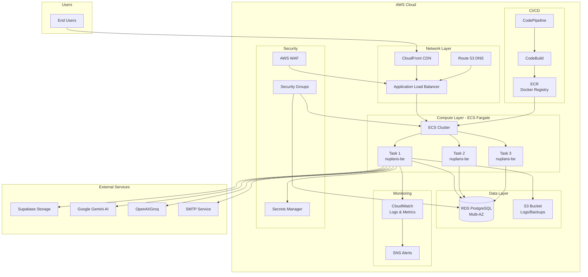
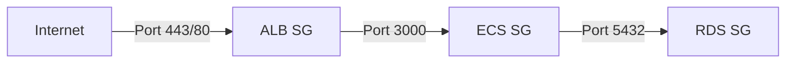
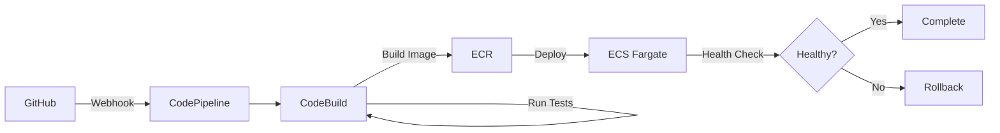

# AWS Production Deployment Guide - Nuplans Backend

## 📋 Tổng quan

Tài liệu này mô tả chi tiết các bước và yêu cầu để deploy dự án **Nuplans Backend** lên môi trường production trên AWS.

## 🏗️ Kiến trúc AWS đề xuất



---

## 🎯 Các AWS Services cần thiết

### 1. **Compute - ECS Fargate** (Recommended)

> **Lý do chọn**: Serverless container orchestration, không cần quản lý EC2 instances, auto-scaling tốt

#### Cấu hình ECS Cluster

**Task Definition:**
```json
{
  "family": "nuplans-backend",
  "networkMode": "awsvpc",
  "requiresCompatibilities": ["FARGATE"],
  "cpu": "512",
  "memory": "1024",
  "containerDefinitions": [
    {
      "name": "nuplans-be",
      "image": "<AWS_ACCOUNT_ID>.dkr.ecr.<REGION>.amazonaws.com/nuplans-be:latest",
      "portMappings": [
        {
          "containerPort": 3000,
          "protocol": "tcp"
        }
      ],
      "environment": [
        {
          "name": "NODE_ENV",
          "value": "production"
        },
        {
          "name": "PORT",
          "value": "3000"
        }
      ],
      "secrets": [
        {
          "name": "DB_HOST",
          "valueFrom": "arn:aws:secretsmanager:region:account:secret:nuplans/db-host"
        },
        {
          "name": "DB_PASSWORD",
          "valueFrom": "arn:aws:secretsmanager:region:account:secret:nuplans/db-password"
        },
        {
          "name": "JWT_SECRET",
          "valueFrom": "arn:aws:secretsmanager:region:account:secret:nuplans/jwt-secret"
        }
      ],
      "logConfiguration": {
        "logDriver": "awslogs",
        "options": {
          "awslogs-group": "/ecs/nuplans-backend",
          "awslogs-region": "ap-southeast-1",
          "awslogs-stream-prefix": "ecs"
        }
      },
      "healthCheck": {
        "command": ["CMD-SHELL", "curl -f http://localhost:3000/health || exit 1"],
        "interval": 30,
        "timeout": 5,
        "retries": 3,
        "startPeriod": 60
      }
    }
  ]
}
```

**Service Configuration:**
- **Desired count**: 2 (minimum for high availability)
- **Auto-scaling**: 2-10 tasks based on CPU/Memory
- **Deployment**: Rolling update with 50% minimum healthy

#### Alternative: EC2 với Docker

Nếu muốn kiểm soát nhiều hơn hoặc tiết kiệm chi phí:
- **Instance type**: t3.medium (2 vCPU, 4GB RAM)
- **Auto Scaling Group**: Min 2, Max 4
- **AMI**: Amazon Linux 2 với Docker pre-installed

---

### 2. **Database - RDS PostgreSQL**

#### Cấu hình Production

```yaml
Engine: PostgreSQL 15
Instance Class: db.t3.medium (2 vCPU, 4GB RAM)
Storage: 
  - Type: gp3 (General Purpose SSD)
  - Size: 100 GB
  - Auto-scaling: Enable (max 500 GB)
Multi-AZ: Yes (High Availability)
Backup:
  - Retention: 7 days
  - Backup window: 03:00-04:00 UTC
  - Snapshot: Daily
Maintenance Window: Sun 04:00-05:00 UTC
Encryption: Yes (KMS)
Performance Insights: Enable
Enhanced Monitoring: Enable (60 seconds)
```

#### Security Groups

```yaml
Inbound Rules:
  - Type: PostgreSQL
    Port: 5432
    Source: ECS Security Group
    Description: Allow from ECS tasks only

Outbound Rules:
  - Type: All traffic
    Destination: 0.0.0.0/0
```

#### Parameter Group

Tạo custom parameter group với các settings tối ưu:

```sql
-- Connection settings
max_connections = 200
shared_buffers = 1GB
effective_cache_size = 3GB
work_mem = 5MB

-- Logging
log_min_duration_statement = 1000  -- Log queries > 1s
log_connections = on
log_disconnections = on
```

---

### 3. **Container Registry - ECR**

#### Tạo Repository

```bash
aws ecr create-repository \
  --repository-name nuplans-be \
  --region ap-southeast-1 \
  --image-scanning-configuration scanOnPush=true \
  --encryption-configuration encryptionType=AES256
```

#### Lifecycle Policy

Tự động xóa old images để tiết kiệm storage:

```json
{
  "rules": [
    {
      "rulePriority": 1,
      "description": "Keep last 10 images",
      "selection": {
        "tagStatus": "any",
        "countType": "imageCountMoreThan",
        "countNumber": 10
      },
      "action": {
        "type": "expire"
      }
    }
  ]
}
```

---

### 4. **Load Balancer - Application Load Balancer (ALB)**

#### Cấu hình

```yaml
Scheme: internet-facing
IP address type: ipv4
Listeners:
  - Protocol: HTTPS
    Port: 443
    SSL Certificate: ACM Certificate
    Default Action: Forward to Target Group
  - Protocol: HTTP
    Port: 80
    Default Action: Redirect to HTTPS

Target Group:
  - Protocol: HTTP
  - Port: 3000
  - Health Check:
      Path: /health
      Interval: 30 seconds
      Timeout: 5 seconds
      Healthy threshold: 2
      Unhealthy threshold: 3
  - Deregistration delay: 30 seconds
```

#### Security Group

```yaml
Inbound:
  - Type: HTTPS
    Port: 443
    Source: 0.0.0.0/0
  - Type: HTTP
    Port: 80
    Source: 0.0.0.0/0

Outbound:
  - Type: All traffic
    Destination: ECS Security Group
```

---

### 5. **Secrets Management - AWS Secrets Manager**

#### Secrets cần lưu trữ

```bash
# Database credentials
aws secretsmanager create-secret \
  --name nuplans/production/db \
  --secret-string '{
    "host": "nuplans-db.xxxxx.ap-southeast-1.rds.amazonaws.com",
    "port": "5432",
    "username": "nuplans_admin",
    "password": "STRONG_PASSWORD_HERE",
    "database": "nuplans_production"
  }'

# JWT Secret
aws secretsmanager create-secret \
  --name nuplans/production/jwt \
  --secret-string '{
    "secret": "YOUR_SUPER_SECRET_JWT_KEY_HERE",
    "expiresIn": "24h"
  }'

# SMTP Configuration
aws secretsmanager create-secret \
  --name nuplans/production/smtp \
  --secret-string '{
    "host": "smtp.gmail.com",
    "port": "587",
    "user": "your_email@gmail.com",
    "password": "your_app_password",
    "from": "Nuplans Support <no-reply@nuplans.com>"
  }'

# AI API Keys
aws secretsmanager create-secret \
  --name nuplans/production/ai-keys \
  --secret-string '{
    "gemini_api_key": "YOUR_GEMINI_KEY",
    "openai_api_key": "YOUR_OPENAI_KEY",
    "milestone_action_key": "YOUR_KEY",
    "planning_key": "YOUR_KEY",
    "parse_cv_key": "YOUR_KEY"
  }'

# Supabase
aws secretsmanager create-secret \
  --name nuplans/production/supabase \
  --secret-string '{
    "url": "https://xxxxx.supabase.co",
    "service_role_key": "YOUR_SERVICE_ROLE_KEY"
  }'
```

#### IAM Policy cho ECS Task Role

```json
{
  "Version": "2012-10-17",
  "Statement": [
    {
      "Effect": "Allow",
      "Action": [
        "secretsmanager:GetSecretValue"
      ],
      "Resource": [
        "arn:aws:secretsmanager:ap-southeast-1:*:secret:nuplans/production/*"
      ]
    }
  ]
}
```

---

### 6. **Storage - S3**

#### Buckets cần tạo

**1. Logs Bucket**
```bash
aws s3 mb s3://nuplans-production-logs
```

**Lifecycle Policy:**
```json
{
  "Rules": [
    {
      "Id": "archive-old-logs",
      "Status": "Enabled",
      "Transitions": [
        {
          "Days": 30,
          "StorageClass": "STANDARD_IA"
        },
        {
          "Days": 90,
          "StorageClass": "GLACIER"
        }
      ],
      "Expiration": {
        "Days": 365
      }
    }
  ]
}
```

**2. Backup Bucket**
```bash
aws s3 mb s3://nuplans-production-backups
```

**3. Static Assets (nếu cần)**
```bash
aws s3 mb s3://nuplans-production-assets
```

---

### 7. **Monitoring - CloudWatch**

#### Log Groups

```bash
# Application logs
aws logs create-log-group --log-group-name /ecs/nuplans-backend

# Set retention
aws logs put-retention-policy \
  --log-group-name /ecs/nuplans-backend \
  --retention-in-days 30
```

#### Metrics & Alarms

**CPU Utilization Alarm:**
```bash
aws cloudwatch put-metric-alarm \
  --alarm-name nuplans-high-cpu \
  --alarm-description "Alert when CPU exceeds 80%" \
  --metric-name CPUUtilization \
  --namespace AWS/ECS \
  --statistic Average \
  --period 300 \
  --threshold 80 \
  --comparison-operator GreaterThanThreshold \
  --evaluation-periods 2
```

**Memory Utilization Alarm:**
```bash
aws cloudwatch put-metric-alarm \
  --alarm-name nuplans-high-memory \
  --alarm-description "Alert when memory exceeds 80%" \
  --metric-name MemoryUtilization \
  --namespace AWS/ECS \
  --statistic Average \
  --period 300 \
  --threshold 80 \
  --comparison-operator GreaterThanThreshold \
  --evaluation-periods 2
```

**Database Connections Alarm:**
```bash
aws cloudwatch put-metric-alarm \
  --alarm-name nuplans-db-connections \
  --alarm-description "Alert when DB connections exceed 150" \
  --metric-name DatabaseConnections \
  --namespace AWS/RDS \
  --statistic Average \
  --period 300 \
  --threshold 150 \
  --comparison-operator GreaterThanThreshold \
  --evaluation-periods 1
```

#### Dashboard

Tạo dashboard để monitor:
- ECS Service: CPU, Memory, Task count
- RDS: Connections, CPU, Storage, IOPS
- ALB: Request count, Response time, Error rate
- Application: Custom metrics từ Winston logs

---

### 8. **DNS & SSL - Route 53 + ACM**

#### Route 53

```bash
# Tạo hosted zone
aws route53 create-hosted-zone \
  --name api.nuplans.com \
  --caller-reference $(date +%s)

# Tạo A record trỏ đến ALB
aws route53 change-resource-record-sets \
  --hosted-zone-id Z1234567890ABC \
  --change-batch '{
    "Changes": [{
      "Action": "CREATE",
      "ResourceRecordSet": {
        "Name": "api.nuplans.com",
        "Type": "A",
        "AliasTarget": {
          "HostedZoneId": "Z215JYRZR1TBD5",
          "DNSName": "nuplans-alb-123456789.ap-southeast-1.elb.amazonaws.com",
          "EvaluateTargetHealth": true
        }
      }
    }]
  }'
```

#### ACM Certificate

```bash
# Request certificate
aws acm request-certificate \
  --domain-name api.nuplans.com \
  --validation-method DNS \
  --subject-alternative-names "*.api.nuplans.com"

# Validate via DNS (add CNAME records to Route 53)
```

---

### 9. **Security - WAF & Security Groups**

#### AWS WAF

Tạo Web ACL để bảo vệ ALB:

```yaml
Rules:
  1. Rate Limiting:
     - Limit: 2000 requests per 5 minutes per IP
     - Action: Block
  
  2. Geo Blocking (optional):
     - Allow: VN, US, SG
     - Block: Others
  
  3. SQL Injection Protection:
     - Managed Rule: AWSManagedRulesSQLiRuleSet
  
  4. Known Bad Inputs:
     - Managed Rule: AWSManagedRulesKnownBadInputsRuleSet
  
  5. IP Reputation:
     - Managed Rule: AWSManagedRulesAmazonIpReputationList
```

#### Security Groups Summary



---

### 10. **Auto Scaling**

#### ECS Service Auto Scaling

**Target Tracking Scaling Policy:**

```json
{
  "TargetTrackingScalingPolicyConfiguration": {
    "TargetValue": 70.0,
    "PredefinedMetricSpecification": {
      "PredefinedMetricType": "ECSServiceAverageCPUUtilization"
    },
    "ScaleOutCooldown": 60,
    "ScaleInCooldown": 300
  }
}
```

**Configuration:**
- Min tasks: 2
- Max tasks: 10
- Target CPU: 70%
- Target Memory: 80%

---

## 🔧 Cấu hình cần thay đổi trong code

### 1. **Environment Variables**

Cập nhật file `.env.production`:

```env
NODE_ENV=production
PORT=3000

# Database - Sẽ được inject từ Secrets Manager
DB_HOST=${DB_HOST}
DB_PORT=5432
DB_USERNAME=${DB_USERNAME}
DB_PASSWORD=${DB_PASSWORD}
DB_NAME=nuplans_production
DB_SYNC=false  # QUAN TRỌNG: Tắt auto-sync trong production
DB_LOGGING=false

# JWT
JWT_SECRET=${JWT_SECRET}
JWT_EXPIRES_IN=24h

# SMTP
SMTP_HOST=${SMTP_HOST}
SMTP_PORT=${SMTP_PORT}
SMTP_USER=${SMTP_USER}
SMTP_PASS=${SMTP_PASS}
SMTP_FROM=${SMTP_FROM}

# App
APP_URL=https://api.nuplans.com

# AI Configuration
GEMINI_API_KEY=${GEMINI_API_KEY}
GEMINI_MODEL=gemini-1.5-flash
OPENAI_API_KEY=${OPENAI_API_KEY}
OPENAI_MODEL=gpt-4-turbo
OPENAI_BASE_URL=https://api.groq.com/openai/v1

# Supabase
SUPABASE_URL=${SUPABASE_URL}
SUPABASE_SERVICE_ROLE_KEY=${SUPABASE_SERVICE_ROLE_KEY}
CV_BUCKET=cvs

# CORS
CORS_ORIGIN=https://app.nuplans.com

# Logging
LOG_LEVEL=info
```

### 2. **Database Migrations**

> [!IMPORTANT]
> Tắt `synchronize: true` trong production và sử dụng migrations

Cập nhật [`src/data-source.ts`](file:///home/vietdv/Documents/nuplans/nuplans-be/src/data-source.ts):

```typescript
const AppDataSource = new DataSource({
    type: 'postgres',
    host: config.DB.HOST,
    port: config.DB.PORT,
    username: config.DB.USERNAME,
    password: config.DB.PASSWORD,
    database: config.DB.NAME,
    synchronize: config.NODE_ENV !== 'production', // Chỉ sync ở dev
    logging: config.DB.LOGGING,
    entities: [
        __dirname + '/models/*.ts',
        __dirname + '/models/*.js'
    ],
    migrations: [
        __dirname + '/database/migrations/*.ts',
        __dirname + '/database/migrations/*.js'
    ],
    subscribers: [],
    ssl: config.NODE_ENV === 'production' ? {
        rejectUnauthorized: false // RDS SSL
    } : false,
});
```

**Tạo migration scripts trong `package.json`:**

```json
{
  "scripts": {
    "migration:generate": "typeorm-ts-node-commonjs migration:generate",
    "migration:run": "typeorm-ts-node-commonjs migration:run",
    "migration:revert": "typeorm-ts-node-commonjs migration:revert"
  }
}
```

### 3. **Health Check Endpoint**

Đảm bảo health check endpoint hoạt động tốt:

```typescript
// src/routes/health.ts
app.get('/health', async (req, res) => {
    try {
        // Check database connection
        await AppDataSource.query('SELECT 1');
        
        res.json({
            status: 'ok',
            message: 'Server is running',
            timestamp: new Date().toISOString(),
            database: 'connected',
            uptime: process.uptime()
        });
    } catch (error) {
        res.status(503).json({
            status: 'error',
            message: 'Service unavailable',
            database: 'disconnected'
        });
    }
});
```

### 4. **Graceful Shutdown**

Thêm vào `src/index.ts`:

```typescript
// Graceful shutdown
const gracefulShutdown = async () => {
    logger.info('Received shutdown signal, closing server gracefully...');
    
    server.close(async () => {
        logger.info('HTTP server closed');
        
        // Close database connection
        if (AppDataSource.isInitialized) {
            await AppDataSource.destroy();
            logger.info('Database connection closed');
        }
        
        // Close other connections (Redis, etc.)
        
        process.exit(0);
    });
    
    // Force shutdown after 30 seconds
    setTimeout(() => {
        logger.error('Forced shutdown after timeout');
        process.exit(1);
    }, 30000);
};

process.on('SIGTERM', gracefulShutdown);
process.on('SIGINT', gracefulShutdown);
```

### 5. **CORS Configuration**

Cập nhật CORS cho production:

```typescript
// src/middlewares/cors.ts
const corsOptions = {
    origin: process.env.CORS_ORIGIN?.split(',') || ['https://app.nuplans.com'],
    credentials: true,
    optionsSuccessStatus: 200,
    methods: ['GET', 'POST', 'PUT', 'PATCH', 'DELETE', 'OPTIONS'],
    allowedHeaders: ['Content-Type', 'Authorization', 'X-Trace-Id']
};

app.use(cors(corsOptions));
```

### 6. **Rate Limiting**

Thêm rate limiting middleware:

```bash
npm install express-rate-limit
```

```typescript
// src/middlewares/rateLimiter.ts
import rateLimit from 'express-rate-limit';

export const apiLimiter = rateLimit({
    windowMs: 15 * 60 * 1000, // 15 minutes
    max: 100, // Limit each IP to 100 requests per windowMs
    message: 'Too many requests from this IP, please try again later.',
    standardHeaders: true,
    legacyHeaders: false,
});

// Apply to all routes
app.use('/api/', apiLimiter);
```

---

## 🚀 CI/CD Pipeline với AWS CodePipeline

### Architecture



### 1. **buildspec.yml**

Tạo file `buildspec.yml` trong root project:

```yaml
version: 0.2

phases:
  pre_build:
    commands:
      - echo Logging in to Amazon ECR...
      - aws ecr get-login-password --region $AWS_DEFAULT_REGION | docker login --username AWS --password-stdin $AWS_ACCOUNT_ID.dkr.ecr.$AWS_DEFAULT_REGION.amazonaws.com
      - REPOSITORY_URI=$AWS_ACCOUNT_ID.dkr.ecr.$AWS_DEFAULT_REGION.amazonaws.com/nuplans-be
      - COMMIT_HASH=$(echo $CODEBUILD_RESOLVED_SOURCE_VERSION | cut -c 1-7)
      - IMAGE_TAG=${COMMIT_HASH:=latest}
  
  build:
    commands:
      - echo Build started on `date`
      - echo Building the Docker image...
      - docker build -t $REPOSITORY_URI:latest .
      - docker tag $REPOSITORY_URI:latest $REPOSITORY_URI:$IMAGE_TAG
  
  post_build:
    commands:
      - echo Build completed on `date`
      - echo Pushing the Docker images...
      - docker push $REPOSITORY_URI:latest
      - docker push $REPOSITORY_URI:$IMAGE_TAG
      - echo Writing image definitions file...
      - printf '[{"name":"nuplans-be","imageUri":"%s"}]' $REPOSITORY_URI:$IMAGE_TAG > imagedefinitions.json

artifacts:
  files:
    - imagedefinitions.json
```

### 2. **CodeBuild Project**

```yaml
Name: nuplans-backend-build
Source: GitHub
Environment:
  Type: Linux
  Image: aws/codebuild/standard:7.0
  Compute: BUILD_GENERAL1_SMALL
  Privileged: true  # Required for Docker
Environment Variables:
  - AWS_DEFAULT_REGION: ap-southeast-1
  - AWS_ACCOUNT_ID: <your-account-id>
Buildspec: buildspec.yml
```

### 3. **CodePipeline**

```yaml
Pipeline Name: nuplans-backend-pipeline

Stages:
  1. Source:
     - Provider: GitHub
     - Repository: nuplans-be
     - Branch: main
     - Webhook: Yes
  
  2. Build:
     - Provider: CodeBuild
     - Project: nuplans-backend-build
  
  3. Deploy:
     - Provider: ECS
     - Cluster: nuplans-production
     - Service: nuplans-backend-service
     - Image: imagedefinitions.json
```

---

## 📊 Cost Estimation (Monthly)

| Service | Configuration | Estimated Cost |
|---------|--------------|----------------|
| **ECS Fargate** | 2-4 tasks (0.5 vCPU, 1GB) | $30-60 |
| **RDS PostgreSQL** | db.t3.medium, Multi-AZ | $120 |
| **ALB** | Standard | $25 |
| **ECR** | 10 GB storage | $1 |
| **S3** | 50 GB storage + requests | $5 |
| **CloudWatch** | Logs + Metrics | $10 |
| **Secrets Manager** | 5 secrets | $2 |
| **Route 53** | 1 hosted zone | $0.50 |
| **Data Transfer** | ~100 GB/month | $9 |
| **WAF** | Basic rules | $10 |
| **Total** | | **~$212-242/month** |

> [!NOTE]
> Chi phí thực tế có thể thay đổi tùy thuộc vào traffic và usage patterns

---

## 🔐 Security Checklist

- [ ] Enable RDS encryption at rest
- [ ] Enable RDS encryption in transit (SSL)
- [ ] Use Secrets Manager for all sensitive data
- [ ] Enable CloudTrail for audit logging
- [ ] Configure WAF rules
- [ ] Implement rate limiting
- [ ] Use Security Groups with least privilege
- [ ] Enable VPC Flow Logs
- [ ] Set up AWS GuardDuty
- [ ] Enable MFA for AWS root account
- [ ] Use IAM roles instead of access keys
- [ ] Implement backup strategy
- [ ] Set up disaster recovery plan
- [ ] Regular security patches and updates
- [ ] Enable AWS Config for compliance

---

## 📝 Deployment Checklist

### Pre-deployment

- [ ] Review and update environment variables
- [ ] Create all required AWS resources
- [ ] Set up Secrets Manager with all credentials
- [ ] Configure RDS database
- [ ] Run database migrations
- [ ] Build and push Docker image to ECR
- [ ] Configure ECS task definition
- [ ] Set up ALB and target groups
- [ ] Configure Route 53 DNS
- [ ] Request and validate SSL certificate
- [ ] Set up CloudWatch alarms
- [ ] Configure auto-scaling policies
- [ ] Set up WAF rules
- [ ] Configure backup policies

### Deployment

- [ ] Deploy ECS service
- [ ] Verify health checks passing
- [ ] Test API endpoints
- [ ] Verify database connectivity
- [ ] Test external service integrations (Supabase, AI APIs)
- [ ] Verify CORS configuration
- [ ] Test authentication flow
- [ ] Verify logging is working
- [ ] Check CloudWatch metrics

### Post-deployment

- [ ] Monitor application logs
- [ ] Monitor CloudWatch metrics
- [ ] Set up alerts and notifications
- [ ] Document deployment process
- [ ] Create runbook for common issues
- [ ] Set up monitoring dashboard
- [ ] Schedule regular backups
- [ ] Plan for disaster recovery testing

---

## 🆘 Troubleshooting

### Common Issues

**1. ECS Tasks failing to start**
```bash
# Check task logs
aws logs tail /ecs/nuplans-backend --follow

# Check task definition
aws ecs describe-tasks --cluster nuplans-production --tasks <task-id>
```

**2. Database connection issues**
```bash
# Test from ECS task
aws ecs execute-command \
  --cluster nuplans-production \
  --task <task-id> \
  --container nuplans-be \
  --interactive \
  --command "/bin/sh"

# Inside container
nc -zv <rds-endpoint> 5432
```

**3. High latency**
- Check RDS Performance Insights
- Review CloudWatch metrics
- Check ALB target health
- Review application logs for slow queries

---

## 📚 Additional Resources

### AWS Documentation
- [ECS Best Practices](https://docs.aws.amazon.com/AmazonECS/latest/bestpracticesguide/)
- [RDS Best Practices](https://docs.aws.amazon.com/AmazonRDS/latest/UserGuide/CHAP_BestPractices.html)
- [Well-Architected Framework](https://aws.amazon.com/architecture/well-architected/)

### Monitoring & Alerting
- Set up PagerDuty or similar for critical alerts
- Create CloudWatch dashboard for key metrics
- Enable AWS X-Ray for distributed tracing

### Backup Strategy
- RDS automated backups: 7 days retention
- Manual snapshots before major changes
- Export logs to S3 for long-term storage
- Test restore procedures quarterly

---

## 🎯 Next Steps

1. **Phase 1 - Infrastructure Setup** (Week 1)
   - Create AWS account and set up billing alerts
   - Set up VPC, subnets, and security groups
   - Create RDS instance
   - Set up ECR repository

2. **Phase 2 - Application Deployment** (Week 2)
   - Configure Secrets Manager
   - Build and push Docker image
   - Create ECS cluster and service
   - Set up ALB and Route 53

3. **Phase 3 - CI/CD** (Week 3)
   - Set up CodePipeline
   - Configure automated deployments
   - Test rollback procedures

4. **Phase 4 - Monitoring & Optimization** (Week 4)
   - Set up CloudWatch dashboards
   - Configure alarms and notifications
   - Performance testing and optimization
   - Documentation and runbooks

---

**Made with ❤️ for Nuplans Production Deployment**
